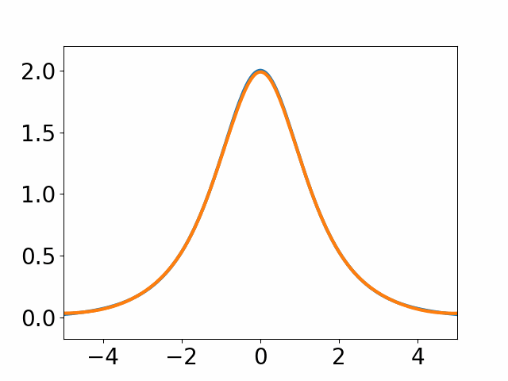
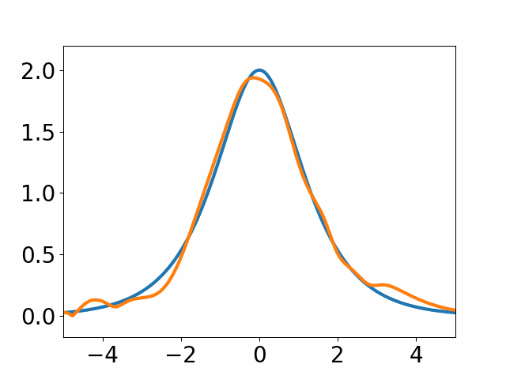
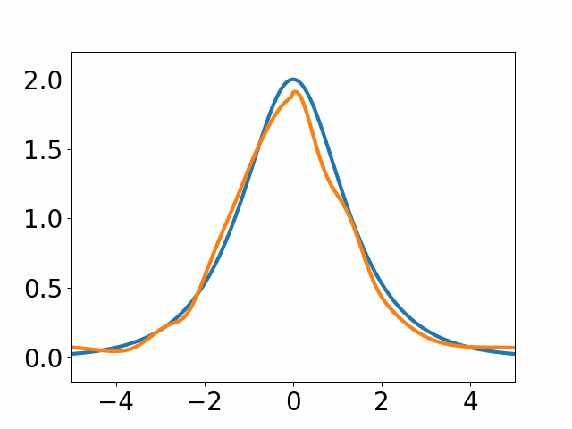
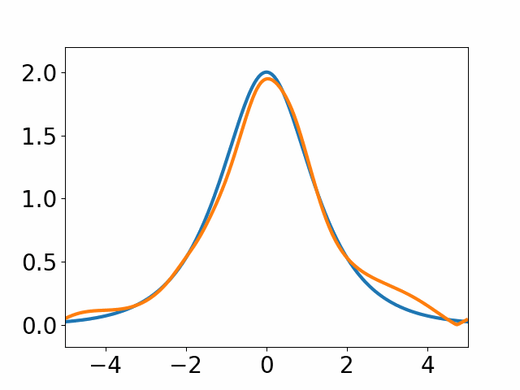
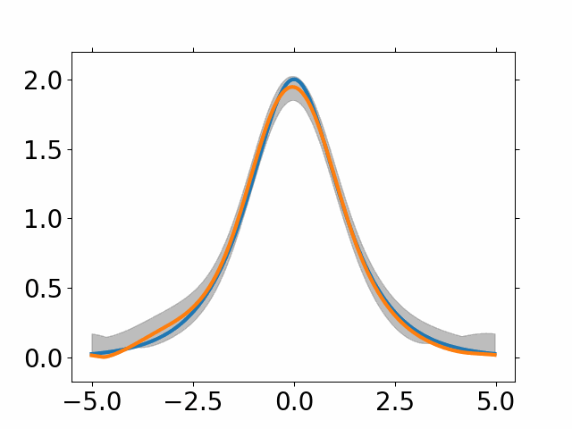
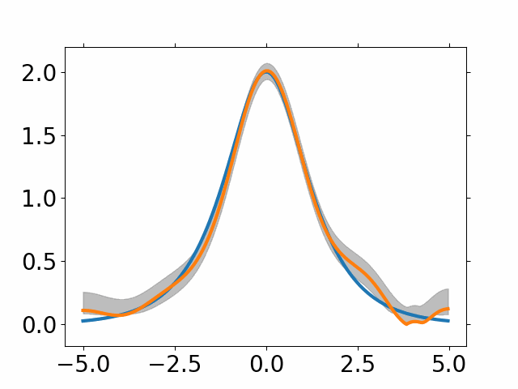
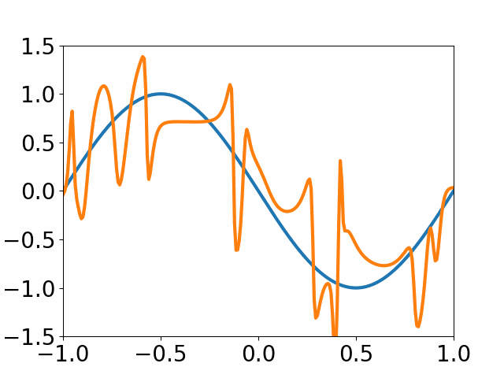
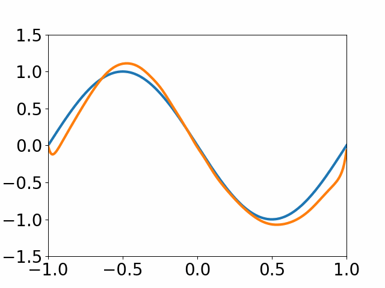

# Robust Physics Informed Neural Networks

Physics-informed Neural Networks (PINNs) have been shown to be effective in solving partial differential equations by capturing the physics induced constraints as a part of the training loss function. This paper shows that a PINN can be sensitive to errors in training data and overfit itself in dynamically propagating these errors over the domain of the solution of the PDE. It also shows how physical regularizations based on continuity criteria and conservation laws fail to address this issue and rather introduces problems of their own causing the deep network to converge to a physics-obeying local minimum instead of the global minimum. We introduce Gaussian Process (GP) based smoothing that recovers the performance of a PINN and promises a robust architecture against noise/errors in measurements. Additionally, we illustrate an inexpensive method of quantifying the evolution of uncertainty based on the variance estimation of GPs on boundary data. Robust PINN performance is also shown to be achievable by choice of sparse sets of inducing points based on sparsely induced GPs. We demonstrate the performance of our proposed methods and compare the results existing benchmark models in literature for time-dependent Schrödinger's and Burger's equations.

This repository implements the experiments in the paper:

[Chandrajit Bajaj, Luke McLennan, Timothy Andeen, Avik Roy. Robust learning of physics-informed neural networks. 2021. arXiv:2110.13330](https://arxiv.org/abs/2110.13330)

The webpage for this project can be found [here.](https://cvc-lab.github.io/cvc-website/projects/robust-pinns/)

## Schrödinger Equation Experiments

### Standard PINN with uncorrupted initial data
</img>
### Standard PINN with corrupted initial data
</img>
### 2-domain Conservative PINN
</img>
### PINN with conservation law
</img>
### PINN with Gaussian Process smoothing
</img>
### PINN with sparse Gaussian Process smoothing
</img>

## Burgers Equation Experiments

### Standard PINN with corrupted initial data
</img>
### PINN with sparse Gaussian Process smoothing
</img>

## Acknowledgement
The research for C.B. was supported in part  by NIH-R01GM117594, by the Peter O'Donnell Foundation,  and in part from a grant from the Army Research Office accomplished under Cooperative Agreement Number W911NF-19-2-0333. The work of L.M. was supported by the the Moncreif Summer Undergraduate Internship Program. The work of T.A. and A.R. is supported by U.S. Department of Energy, Office of High Energy Physics under Grant No. DE-SC0007890 .
