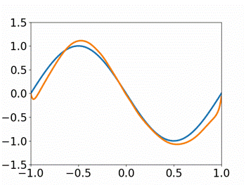

# Robust Physics Informed Neural Networks

Physics-informed Neural Networks (PINNs) have been shown to be effective in solving partial differential equations by capturing the physics induced constraints as a part of the training loss function. This paper shows that a PINN can be sensitive to errors in training data and overfit itself in dynamically propagating these errors over the domain of the solution of the PDE. It also shows how physical regularizations based on continuity criteria and conservation laws fail to address this issue and rather introduces problems of their own causing the deep network to converge to a physics-obeying local minimum instead of the global minimum. We introduce Gaussian Process (GP) based smoothing that recovers the performance of a PINN and promises a robust architecture against noise/errors in measurements. Additionally, we illustrate an inexpensive method of quantifying the evolution of uncertainty based on the variance estimation of GPs on boundary data. Robust PINN performance is also shown to be achievable by choice of sparse sets of inducing points based on sparsely induced GPs. We demonstrate the performance of our proposed methods and compare the results existing benchmark models in literature for time-dependent Schrödinger's and Burger's equations.

This repository implements the experiments in the paper "Robust Physics Informed Neural Networks" [1] (add arVix link).

## Schrödinger Equation Experiments

### Standard PINN with uncorrupted initial data, based on [2]
</img>
### Standard PINN with corrupted initial data
</img>
### 2-domain cPINN based on [3]
</img>
### PINN with conservation law
</img>
### PINN with Gaussian Process smoothing
</img>
### PINN with sparse Gaussian Process smoothing
</img>

## Burgers Equation Experiments

### Standard PINN with corrupted initial data
</img>
### PINN with sparse Gaussian Process smoothing
</img>

## References
[1] Chandrajit Bajaj, Luke McLennan, Timothy Andeen, Avik Roy. Robust physics-informed neural networks. 2021.

[2] Maziar Raissi, Paris Perdikaris, and George E Karniadakis. Physics-informed neural networks: A deep learning framework for solving forward and inverse problems involving nonlinear partial differential equations. Journal of Computational Physics, 378:686–707, 2019.

[3] Ameya D Jagtap, Ehsan Kharazmi, and George Em Karniadakis. Conservative physics-informed neural networks on discrete domains for conservation laws: Applications to forward and inverse problems. Computer Methods in Applied Mechanics and Engineering, 365:113028, 2020.
